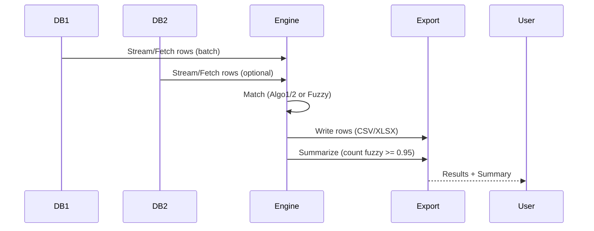

# Name_Matcher Business Process and Requirements Analysis

## Executive Summary
- Objective: Provide fast, accurate, and scalable name matching across one or two MySQL databases with exportable results and audit-quality summaries. Offers both CLI and GUI, with optional CUDA acceleration for fuzzy matching.
- Outcomes: Improve deduplication, identity resolution, and cross-system reconciliation for operational teams. Reduce manual review load by auto‑matching high‑confidence pairs (≥ 95%).
- Scope: Batch matching (streaming or in‑memory), deterministic and fuzzy algorithms, export to CSV/XLSX, summary reports, diagnostics, and robust configuration via .env and GUI.

---

## Current State Analysis

### Business Workflow & Use Cases
- Primary Use Cases
  - Deduplicate within a database (Table 1 vs Table 2 in the same DB)
  - Cross‑database reconciliation (DB1.Table1 vs DB2.Table2)
  - Review pipeline: auto‑accept matches ≥ 95%, queue 85–94.99% for manual review, ignore < 85%
  - Scheduled batch runs (nightly/weekly), on‑demand ad‑hoc runs
- Users & Interactions
  - CLI: scripted jobs, CI/CD, servers without displays
  - GUI: analysts and operators running ad‑hoc or monitored jobs

### Stakeholders, Roles, Responsibilities
- Data Steward / Analyst
  - Configures jobs, executes via GUI, reviews near‑threshold matches, exports reports
- Operations Engineer
  - Automates CLI runs; monitors performance, storage, logs
- DBA
  - Manages schema compatibility, indices, and query performance
- Security / Compliance
  - Ensures credentials handling, PII protection, audit logging
- Developer
  - Extends algorithms; maintains code quality and portability; adds diagnostics

### High-Level Data Flow
```mermaid
flowchart LR
  A[MySQL DB1] -->|SELECT batches| F(Matching Engine)
  B[MySQL DB2 (optional)] -->|SELECT batches| F
  F -->|CSV| O1[Output: matches.csv]
  F -->|XLSX| O2[Output: matches.xlsx]
  F -->|CSV/XLSX| S[Summary Report (timestamped)]
  subgraph Config
    C1[.env / GUI inputs] --> F
  end
  subgraph Diagnostics
    D[CUDA & System Diagnostics] --> U[User]
  end
```

### Components and Integration Points
- Databases: MySQL via sqlx (pooled connections)
- Exports: CSV (stream writing) and XLSX (rust_xlsxwriter)
- Config: .env file parsing + GUI forms
- GPU: CUDA via cudarc (feature-gated); fallback to CPU
- Logging/Diagnostics: progress updates, diagnostics panel (GUI), checkpoint files (.nmckpt)

### Performance & Scalability Considerations
- Data sizes: 10^5 – 10^8 rows per table (streaming mode supports large data)
- Throughput: depends on I/O, network, and selected algorithm; target ≥ 50k rows/second streaming writes on SSD with tuned flush
- Memory: streaming mode fetches in batches; in‑memory mode for smaller datasets; configurable soft free‑memory threshold to adapt batch sizes
- Parallelism: configurable pool size; CPU parallelization; optional GPU acceleration for fuzzy matching
- Resilience: checkpoint files enable resumable runs; progress feedback with ETA and rate (records/sec)

---

## Future State Vision
- Expand diagnostics (hardware, DB latency, index suggestions)
- Parameterized thresholds and rules per use case (e.g., industry- or locale-specific)
- Pluggable backends (PostgreSQL, CSV-to-CSV matching)
- Improved audit artifacts: provenance, configs, environment snapshot, and reproducibility bundles
- Headless diagnostics subcommand for CI verifications

---

## Gap Analysis & Recommendations
- Gap: Limited guidance when GPU missing or misconfigured → Provide richer GUI tips and a “Save diagnostics” action
- Gap: Only MySQL supported → Abstract DB layer further for PostgreSQL adoption
- Gap: Centralized job configuration management → Add JSON/YAML job spec files with versioning
- Gap: Manual review workflow is outside scope → Provide optional export formatted for review systems (e.g., case queues)
- Gap: PII handling policy → Document and enforce data masking in logs and outputs by default

---

## Functional Requirements

### Matching Operations
- FR-1: Support algorithms
  - Algo1: ID/UUID with name + birthdate constraints (deterministic)
  - Algo2: Adds middle name handling and stricter rules (deterministic)
  - Algo3 (Fuzzy): Ensemble (Levenshtein/Jaro/Jaro‑Winkler); requires matching birthdate; outputs confidence [0..1]
- FR-2: Cross-database matching (DB1.Table1 vs DB2.Table2) and same-database matching
- FR-3: Streaming mode for large datasets and in‑memory mode for smaller ones
- FR-4: Export results to CSV and/or XLSX
- FR-5: Generate timestamped summary reports (CSV/XLSX)
- FR-6: Enforce fuzzy match accounting threshold at ≥ 0.95 in summaries (counts and derived stats)
- FR-7: GUI & CLI parity for core features and reporting
- FR-8: Checkpointing for resumable runs (.nmckpt)
- FR-9: Optional CUDA acceleration for fuzzy; auto CPU fallback

### Configuration & Environment
- FR-10: Load configuration from .env and GUI fields without overriding OS vars
- FR-11: Generate and load .env from GUI
- FR-12: Validate connectivity and list tables per DB

### Diagnostics & Observability
- FR-13: Show progress (%/ETA), throughput, memory, GPU status
- FR-14: CUDA diagnostics panel (driver version, devices, compute capability, mem free/used), with friendly errors and hints
- FR-15: Error reporting includes SQLSTATE when present and remediation hints

---

## Non-Functional Requirements

### Performance
- NFR-1: Streaming mode shall sustain large dataset processing with bounded memory
- NFR-2: XLSX and CSV writers shall batch/flush efficiently; SSD tuning available

### Security & Compliance
- NFR-3: Credentials only via env/.env or secure stores; no plaintext hardcoding
- NFR-4: Avoid SQL injection by using parameterized queries via sqlx
- NFR-5: PII-lean logging; redact sensitive fields in diagnostics and logs
- NFR-6: Least-privilege DB accounts; TLS recommended for DB connections

### Reliability & Maintainability
- NFR-7: Graceful degradation (GPU → CPU)
- NFR-8: Clear errors with actionable remediation steps
- NFR-9: Unit/integration tests for algorithms, exports, and pipelines

### Usability
- NFR-10: GUI is responsive, with discoverable controls and status feedback
- NFR-11: CLI arguments and help text are self-explanatory; exit codes reflect success/failure

---

## Technical Constraints and Dependencies
- Language: Rust stable
- DB: MySQL (sqlx); pooled connections
- Exports: csv crate, rust_xlsxwriter
- GUI: eframe/egui; rfd for dialogs
- GPU: cudarc (feature = "gpu"); requires compatible NVIDIA driver/CUDA runtime
- OS: Windows/Linux; cross‑platform paths via std::path
- Build: cargo; GPU builds require `--features gpu`

---

## User Interface Requirements

### CLI
- Commands
  - Select DB connection(s) via env/.env
  - Choose tables, algorithm, mode (streaming/in‑memory), output format/path
  - Optional: pool size, batch size, memory threshold, SSD hint
- Outputs
  - CSV/XLSX results and timestamped summary files
  - Structured logs to stdout/stderr

### GUI
- Inputs
  - DB1 connection, optional DB2 connection (enable_dual)
  - Table selections, algorithm, output path and format (CSV/XLSX/Both)
  - Advanced: pool size, batch size, mem threshold MB, SSD checkbox, GPU toggle & mem budget
  - Buttons: Test Connection, Run Matching, Cancel/Pause, Generate .env Template, Load .env File…, CUDA Diagnostics
- Feedback
  - Progress bar, ETA, throughput, memory stats, GPU activity, log tail
  - Post-run notice with output location(s)

---

## Database Schema Requirements and Compatibility
- Person fields used:
  - first_name, middle_name, last_name: optional text
  - birthdate: optional date
  - uuid optional in Table 2 for some workflows (supported)
- Indexing recommendations
  - Indices on name components and birthdate for deterministic algorithms
  - Consider functional/covered indices where supported
- Compatibility
  - Handle NULLs safely across algorithms; preserve behavior when all fields present

### Example Table Expectations (illustrative)
```sql
-- Table 1 (example)
CREATE TABLE people1 (
  id BIGINT PRIMARY KEY,
  first_name VARCHAR(255),
  middle_name VARCHAR(255),
  last_name VARCHAR(255),
  birthdate DATE,
  uuid CHAR(36) NULL
);
```

---

## CUDA/GPU Acceleration Requirements and Fallbacks
- Build-time feature flag: `--features gpu`
- Runtime requirements: NVIDIA driver and compatible CUDA runtime/driver
- Device selection: default device 0; memory budget configurable
- Diagnostics: panel shows driver version, device list, compute capability, total/free/used memory
- Fallback: if CUDA unavailable or errors occur, operations proceed on CPU without crashing
- Performance: GPU path primarily accelerates fuzzy matching; not required for deterministic algorithms

---

## Configuration and Environment

### .env Variables (illustrative)
```bash
DB1_HOST=127.0.0.1
DB1_PORT=3306
DB1_USER=root
DB1_PASS=secret
DB1_NAME=duplicate_checker
DB2_HOST=127.0.0.1
DB2_PORT=3306
DB2_USER=analyst
DB2_PASS=secret
DB2_NAME=other_db
POOL_SIZE=16
BATCH_SIZE=50000
MEM_THRESH_MB=800
USE_GPU=false
GPU_MEM_MB=512
```

### Checkpointing
- Checkpoint files saved alongside outputs: `<output>.nmckpt` enable resume after interruptions

---

## Summary Generation & Threshold Policy
- Summary files
  - CSV and/or XLSX: `summary_report_YYYY-MM-DD_HH-MM-SS.csv|xlsx`
- Fuzzy threshold policy
  - Only matches with confidence ≥ 0.95 are counted as fuzzy matches in summaries
  - Matches below 0.95 are excluded from fuzzy counts and derived statistics

---

## Process Diagrams

### Activity (Run via GUI)
```mermaid
flowchart TD
  S[Start] --> C[Configure DB(s) and Tables]
  C --> A[Select Algorithm & Mode]
  A --> O[Choose Output Format & Path]
  O --> V[Test Connection]
  V -->|OK| R[Run Matching]
  V -->|Fail| E[Fix Config / Credentials]
  R --> P[Track Progress/ETA]
  P --> W[Write CSV/XLSX]
  W --> Y[Generate Summary]
  Y --> D[Optionally View Diagnostics]
  D --> F[Finish]
```

### Data Flow with Thresholding


---

## Implementation Roadmap
- Phase 1 (Now):
  - Stabilize fuzzy ≥ 0.95 summary counting across all code paths (CLI + GUI)
  - CUDA diagnostics panel and CLI diagnostics subcommand (optional)
- Phase 2 (Near Term):
  - Configurable thresholds per run; write policy into summary metadata
  - Enhanced PII redaction; structured JSON logs
  - Save diagnostics to file; copy-to-clipboard in GUI
- Phase 3 (Mid Term):
  - PostgreSQL backend; job spec files; headless diagnostics
  - Review integration export format; provenance bundle

---

## Risk Assessment & Mitigations
- R-1: GPU/Driver incompatibility → Mitigate with diagnostics, CPU fallback
- R-2: Large data I/O bottlenecks → Streaming, SSD flush tuning, pooled connections
- R-3: Schema variance → Table introspection, validation, and clear error messages
- R-4: Credential exposure → .env handling, OS env precedence, avoid logging secrets
- R-5: Incorrect threshold policy → Tests validating counts; config metadata in summary
- R-6: Long runs interrupted → Checkpointing and resume support

---

## Traceability Matrix (Business Need → Requirement)
| Business Need | Requirement IDs |
|---|---|
| Accurate deduplication | FR-1, FR-2, FR-3 |
| High-confidence auto‑match | FR-6, NFR-1 |
| Large-scale processing | FR-3, NFR-1, NFR-2 |
| Portable and operable | CLI/GUI (UI), GPU fallback (NFR-7) |
| Secure credential handling | NFR-3, NFR-4, NFR-5 |
| Diagnostics and supportability | FR-13, FR-14, FR-15 |

---

## Appendix: CLI/GUI Technical Specs (Illustrative)
```text
CLI
- Args: --algo, --format, --mode, --out, --pool-size, --batch-size, --mem-thresh, --ssd, --use-gpu, --gpu-mem
- Env: DB1_*, DB2_* per .env
GUI
- Panels: Connection, Tables, Controls, Advanced, Diagnostics
- Buttons: Test, Run, Cancel/Pause, Generate .env, Load .env, CUDA Diagnostics
- Status: progress %, ETA, RPS, mem, GPU status, log tail
```

